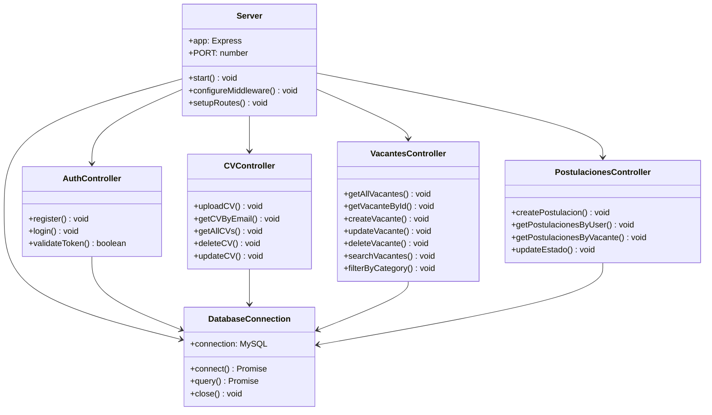
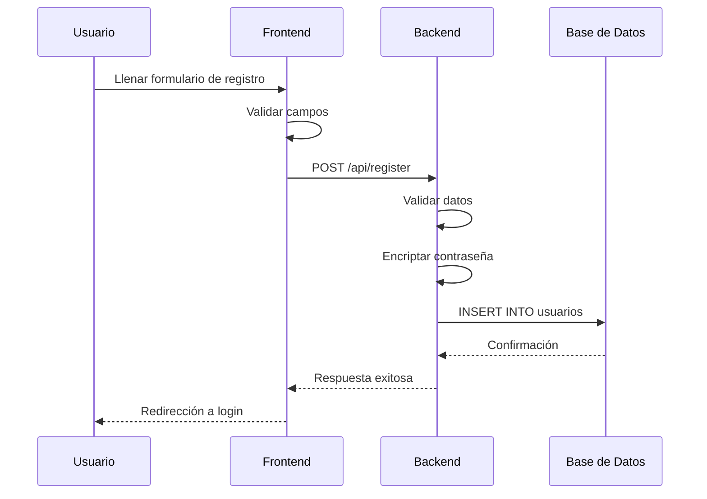
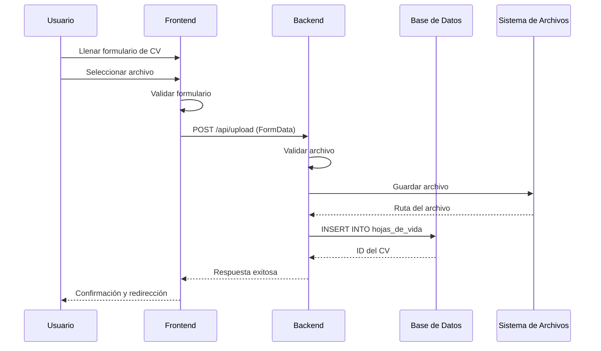
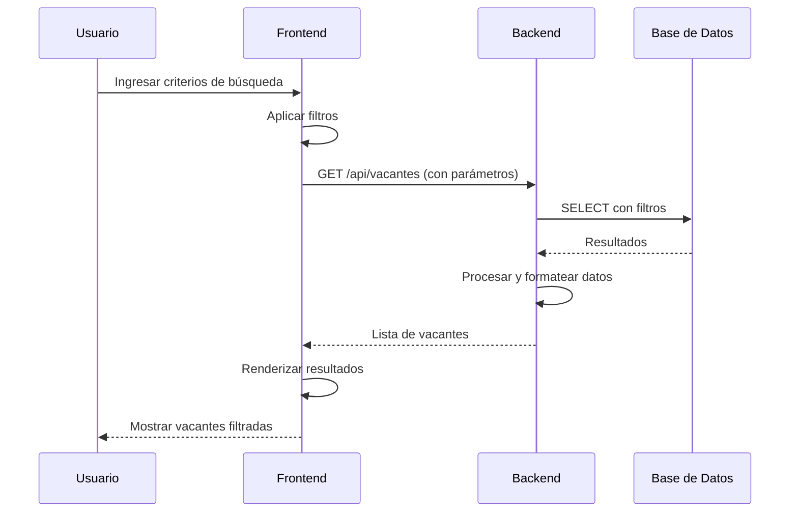
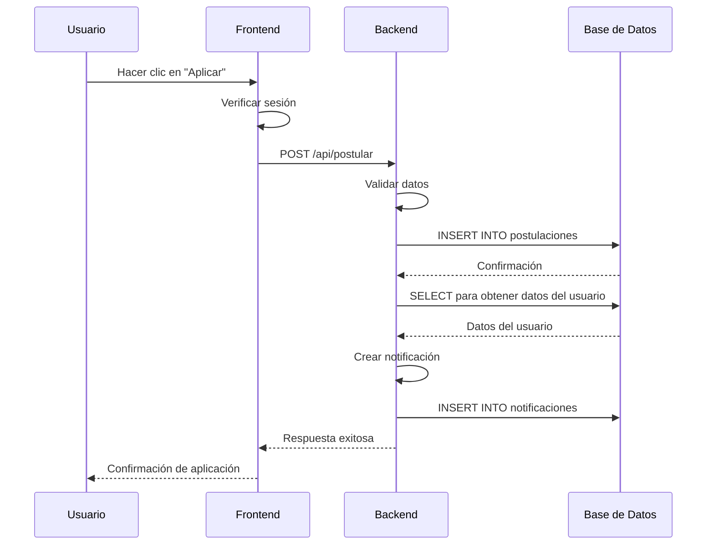
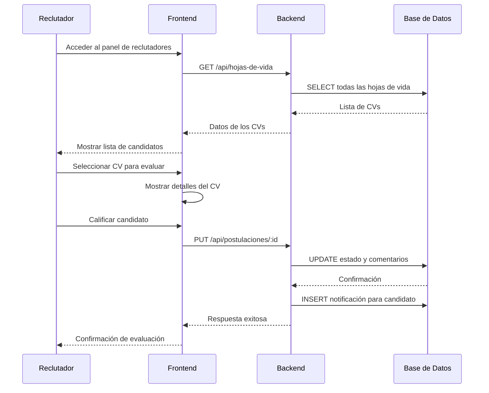

# 🎨 DIAGRAMAS UML - WORKNOW CV RECEPTION APP

## 📅 **INFORMACIÓN DEL DOCUMENTO:**
- **Proyecto:** WorkNow - Sistema de Recepción de CVs
- **Versión:** 1.0.0
- **Fecha:** Diciembre 2024
- **Tipo:** Diagramas UML de Clases y Secuencia

## 🏗️ **DIAGRAMA UML DE CLASES:**

### **Frontend - Componentes React:**

```mermaid
classDiagram
    class App {
        +state: Object
        +render() Component
        +handleNavigation() void
    }

    class Home {
        +state: Object
        +render() Component
        +handleLogout() void
        +navigateToModule() void
    }

    class Login {
        +state: {email, password, isLoading, showPassword}
        +handleSubmit() void
        +togglePassword() void
        +render() Component
    }

    class Register {
        +state: {email, password, confirmPassword, isLoading, showPassword, showConfirmPassword}
        +handleSubmit() void
        +validatePasswords() boolean
        +render() Component
    }

    class Vacantes {
        +state: {vacantes, filteredVacantes, loading, searchTerm, selectedVacante, showModal, favorites, currentPage, itemsPerPage, sortBy, sortOrder, filters}
        +fetchVacantes() void
        +applyFiltersAndSearch() void
        +toggleFavorite() void
        +openVacanteDetail() void
        +handlePostular() void
        +render() Component
    }

    class UploadForm {
        +state: {formData, isLoading}
        +handleSubmit() void
        +handleChange() void
        +clearForm() void
        +render() Component
    }

    class MiHojaDeVida {
        +state: {cv, loading, error}
        +fetchCV() void
        +handleDelete() void
        +handleGoToUpload() void
        +render() Component
    }

    class PanelReclutadores {
        +state: {cvs, loading, filters}
        +fetchCVs() void
        +evaluateCV() void
        +render() Component
    }

    App --> Home
    App --> Login
    App --> Register
    App --> Vacantes
    App --> UploadForm
    App --> MiHojaDeVida
    App --> PanelReclutadores

    Home --> Login
    Home --> Vacantes
    Home --> UploadForm
    Home --> MiHojaDeVida
    Home --> PanelReclutadores
```

### **Backend - Servicios y Rutas:**



### **Base de Datos - Entidades:**

```mermaid
classDiagram
    class Usuario {
        +id: INT (PK)
        +correo: VARCHAR(255) (UK)
        +contrasena: VARCHAR(255)
        +fecha_registro: TIMESTAMP
        +rol: ENUM('candidato', 'reclutador', 'admin')
    }

    class HojaDeVida {
        +id: INT (PK)
        +usuario_id: INT (FK)
        +nombre_completo: VARCHAR(255)
        +correo: VARCHAR(255)
        +telefono: VARCHAR(50)
        +direccion: VARCHAR(255)
        +fecha_nacimiento: DATE
        +nivel_educativo: VARCHAR(255)
        +experiencia_anios: VARCHAR(50)
        +perfil: TEXT
        +archivo: VARCHAR(255)
        +fecha_creacion: TIMESTAMP
        +fecha_actualizacion: TIMESTAMP
    }

    class Vacante {
        +id: INT (PK)
        +empresa_id: INT (FK)
        +titulo: VARCHAR(255)
        +descripcion: TEXT
        +ubicacion: VARCHAR(255)
        +categoria: VARCHAR(255)
        +tipo_contrato: VARCHAR(255)
        +experiencia: VARCHAR(255)
        +salario: DECIMAL(10,2)
        +beneficios: JSON
        +requisitos: JSON
        +responsabilidades: JSON
        +fecha_publicacion: DATE
        +fecha_cierre: DATE
        +estado: ENUM('activa', 'cerrada', 'suspendida')
    }

    class Empresa {
        +id: INT (PK)
        +nombre: VARCHAR(255)
        +descripcion: TEXT
        +ubicacion: VARCHAR(255)
        +contacto: VARCHAR(255)
        +sitio_web: VARCHAR(255)
        +fecha_registro: TIMESTAMP
    }

    class Postulacion {
        +id: INT (PK)
        +vacante_id: INT (FK)
        +usuario_id: INT (FK)
        +fecha_postulacion: TIMESTAMP
        +estado: ENUM('pendiente', 'revisada', 'aceptada', 'rechazada')
        +comentarios: TEXT
        +fecha_evaluacion: TIMESTAMP
    }

    class VacanteFavorita {
        +id: INT (PK)
        +vacante_id: INT (FK)
        +usuario_id: INT (FK)
        +fecha_agregado: TIMESTAMP
    }

    class Notificacion {
        +id: INT (PK)
        +usuario_id: INT (FK)
        +tipo: ENUM('postulacion', 'evaluacion', 'sistema')
        +mensaje: TEXT
        +fecha_creacion: TIMESTAMP
        +leida: BOOLEAN
    }

    Usuario ||--o{ HojaDeVida : "tiene"
    Usuario ||--o{ Postulacion : "realiza"
    Usuario ||--o{ VacanteFavorita : "marca"
    Usuario ||--o{ Notificacion : "recibe"
    
    Vacante ||--o{ Postulacion : "recibe"
    Vacante ||--o{ VacanteFavorita : "es marcada"
    Vacante }o--|| Empresa : "pertenece a"
```

## 🔄 **DIAGRAMAS UML DE SECUENCIA:**

### **1. Flujo de Registro de Usuario:**



### **2. Flujo de Subida de CV:**



### **3. Flujo de Búsqueda de Vacantes:**



### **4. Flujo de Aplicación a Vacante:**



### **5. Flujo de Evaluación de CV (Reclutador):**



## 📊 **DIAGRAMA UML DE COMPONENTES:**

```mermaid
componentDiagram
    component "Frontend (React)" {
        component "Componentes de UI"
        component "Gestión de Estado"
        component "Navegación"
        component "Formularios"
    }

    component "Backend (Node.js)" {
        component "API REST"
        component "Controladores"
        component "Middleware"
        component "Validaciones"
    }

    component "Base de Datos" {
        component "MySQL Server"
        component "Tablas"
        component "Índices"
        component "Procedimientos"
    }

    component "Sistema de Archivos" {
        component "Uploads"
        component "CVs"
        component "Documentos"
    }

    "Frontend (React)" --> "Backend (Node.js)" : HTTP/HTTPS
    "Backend (Node.js)" --> "Base de Datos" : MySQL Connection
    "Backend (Node.js)" --> "Sistema de Archivos" : File I/O
```

## 🔗 **DIAGRAMA UML DE DEPLOYMENT:**

```mermaid
deploymentDiagram
    deployment "Cliente Web" {
        node "Navegador" {
            component "React App"
        }
    }

    deployment "Servidor de Aplicación" {
        node "Node.js Server" {
            component "Express App"
            component "API Routes"
            component "Business Logic"
        }
    }

    deployment "Base de Datos" {
        node "MySQL Server" {
            component "Database Engine"
            component "Tables & Data"
        }
    }

    deployment "Sistema de Archivos" {
        node "File Storage" {
            component "Upload Directory"
            component "CV Files"
        }
    }

    "Cliente Web" --> "Servidor de Aplicación" : HTTP/HTTPS (Port 3001)
    "Servidor de Aplicación" --> "Base de Datos" : MySQL (Port 3306)
    "Servidor de Aplicación" --> "Sistema de Archivos" : Local File System
```

## 📋 **LEGENDA DE SÍMBOLOS UML:**

### **Relaciones:**
- **||--o{** : Uno a muchos (1:N)
- **||--||** : Uno a uno (1:1)
- **}o--o{** : Muchos a muchos (M:N)
- **-->** : Dependencia/Comunicación
- **-->>** : Respuesta/Retorno

### **Modificadores de Acceso:**
- **+** : Público
- **-** : Privado
- **#** : Protegido
- **~** : Paquete

### **Tipos de Datos:**
- **String/VARCHAR** : Texto
- **Integer/INT** : Número entero
- **Boolean/BOOLEAN** : Verdadero/Falso
- **Date/DATE** : Fecha
- **Timestamp/TIMESTAMP** : Fecha y hora
- **JSON** : Objeto JSON
- **Text/TEXT** : Texto largo

## 🎯 **OBJETIVOS DE LOS DIAGRAMAS:**

1. **Visualización Clara:** Mostrar la estructura del sistema de manera comprensible
2. **Documentación Técnica:** Proporcionar referencia para desarrolladores
3. **Análisis de Arquitectura:** Identificar dependencias y relaciones
4. **Planificación de Desarrollo:** Guiar la implementación de nuevas funcionalidades
5. **Mantenimiento:** Facilitar la comprensión del código existente

---

**Documento generado:** Diciembre 2024  
**Versión:** 1.0.0  
**Estado:** Finalizado
